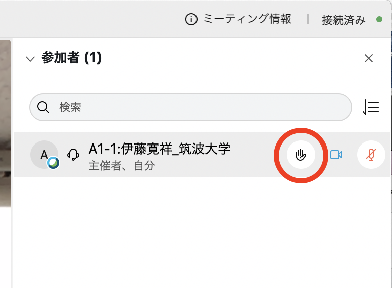

# DEIM2021　聴講者向けマニュアル

[<<Home](README.md)

1. ブラウザで[DEIM2021プログラム](https://cms.deim-forum.org/deim2021/program/)を開き，[Webex Meeting](https://mediafiles.webex.com/ja/downloads.html)のセッションの会議室に入る．
    * 予定されたWebex会議室へアクセスできない場合はポータルトップの案内をご確認ください．
    * トラブルが起きてWebex会議室が立ち上がらなかった場合など，予備のWebex会議室へ移動になることがあります（アクセスURLが変更になります）．その場合はポータルトップへ緊急アナウンスを出します．
1. 質問やコメントがある場合は Webex 上で「挙手」してください．
    * 参加者一覧から自分にカーソルを持っていくと「挙手」ボタンが現れます（下図）．
1. 時間が無く，会議中には質問できなかったことについても，各セッションの「掲示板」にて投稿することができます．
    * セッションのページの左上「購読する」を On にすることで，ポータルからスレッドを参照できるようになります．

注意点
- 外部にへの公開の予定はありませんが，発表の様子は録画されますので予めご了承ください．

（挙手 / Raise a hand）

