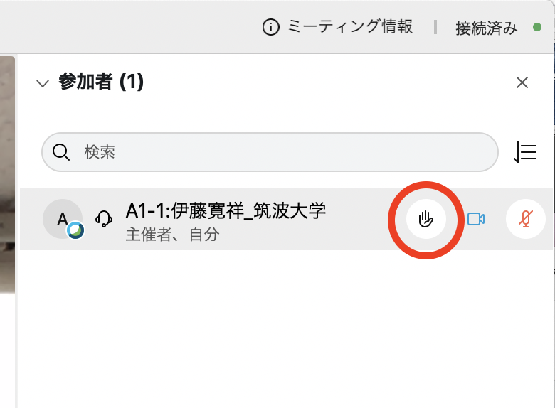

# DEIM2021　聴講者向けマニュアル

[<<Home](README.md)

## DEIM 2022での新しい試みについて
* DEIM 2022ではWebexで研究発表をした際には質疑を行わず、1セッションの全ての発表が終わったら全員でoViceへ移動して、そこでオンラインポスター発表と同様の会場で質疑を行います。
	* 各セッションの構成（125分 or 150分）
		* **Webexで口頭発表**：1件15分の発表 × 4～6件（60～90分）
		* **oVice上での質疑**：1セッション分まとめて残り時間一杯
	* 狙い
		1. 質疑への若手の参加機会の拡大：大勢が見ている中で顔も見えない状態での質疑は、若い人には「場違いでは無いか」と敷居が高い
		2. oViceへ移動する人の流れを作ることでコミュニティ内での会話の機会創出：過去2年のオンライン開催ではコミュニケーション機会が非常に少なかったという問題意識
	* 聴講者の皆様へのお願い
		* 発表終了後は座長と運営のアナウンスに従ってoVice会場へ移り、継続して質疑応答にご参加ください。
		* oVice上での質疑では、若い研究者の皆様も座長やベテラン研究者に遠慮する必要はありません。むしろ「若い者順」ぐらいの気持ちで発表者達へ沢山質問をしてみてください。真剣に質疑する経験が皆様の研究能力の向上に必ず役に立つと思います。

1. ブラウザで[DEIM2022プログラム](https://cms.deim-forum.org/deim2021/program/)を開き，[Webex Meeting](https://mediafiles.webex.com/ja/downloads.html)のセッションの会議室に入る．
    * 予定されたWebex会議室へアクセスできない場合はポータルトップの案内をご確認ください．
    * トラブルが起きてWebex会議室が立ち上がらなかった場合など，予備のWebex会議室へ移動になることがあります（アクセスURLが変更になります）．その場合はポータルトップへ緊急アナウンスを出します．
1. 時間が無く，oViceにおける質疑では質問できなかったことについても，各セッションの「掲示板」にて投稿することができます．
    * セッションのページの左上「購読する」を On にすることで，ポータルからスレッドを参照できるようになります．
1. 積極的に掲示板での議論をしたり，良いと思った研究に対して「いいね」「超いいね」ボタンを押してください．
    * これらの統計情報をもとに「注目研究賞」が決定されます．
    * 積極的に活性化してくださった聴講者には感謝状を授与する予定です．

注意点
- 外部への公開の予定はありませんが，発表の様子は録画されますので予めご了承ください．
- 各種アナウンスは原則ポータル上で行われますので，適宜ご確認ください．

（挙手 / Raise a hand）

