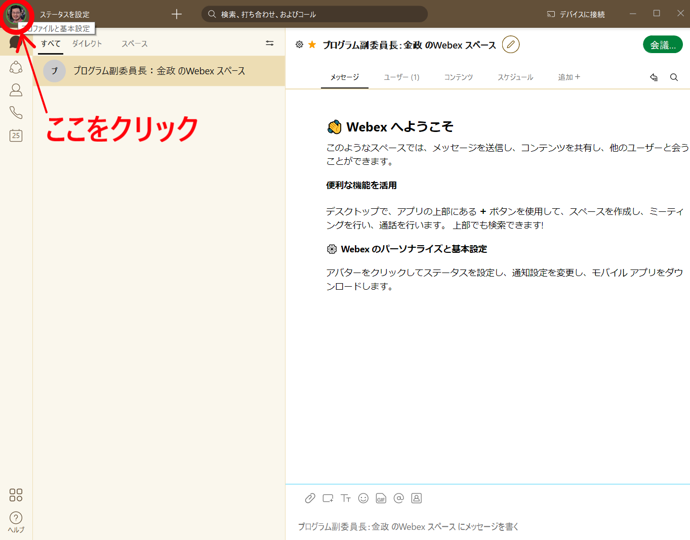
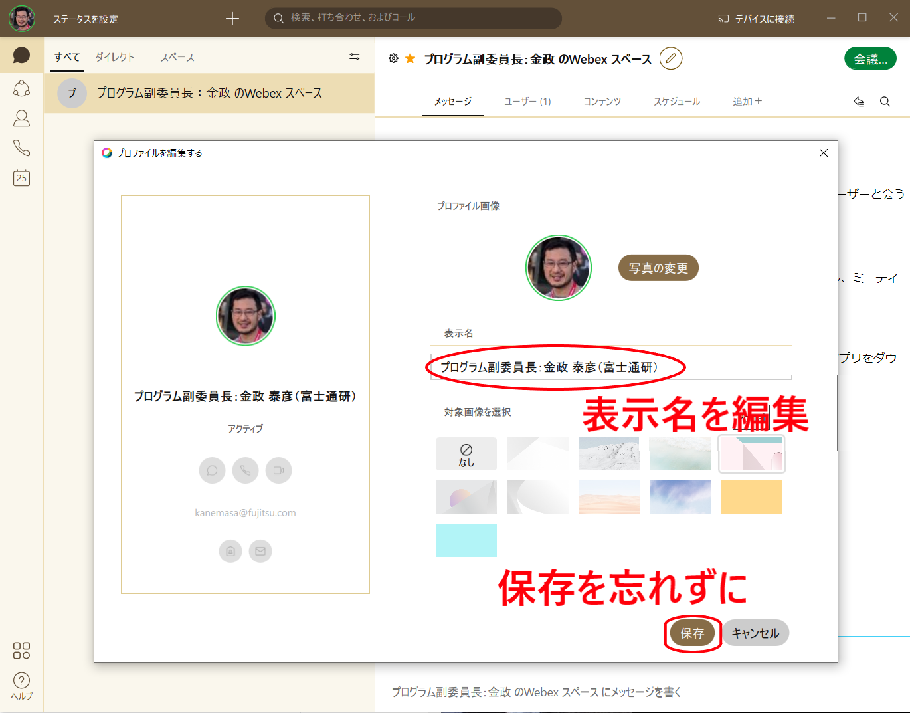

# DEIM 座長・コメンテータマニュアル

## 【重要！】DEIM 2022での新しい口頭発表形式について
* DEIM 2022ではWebexで研究発表をした際には質疑を行わず，1セッションの全ての発表が終わったら全員でoViceへ移動して，そこでまとめて質疑を行います．oVice内の質疑会場はオンラインポスター発表と同様の会場で，質疑の進行もポスター発表と同様です．
	* 各セッションの構成（125分 or 150分）
		* **前半：Webexで口頭発表**：1件15分の発表 × 4～6件（60～90分）
		* **後半：oVice上での質疑**：1セッション分まとめて残り時間一杯
	* 狙い
		1. 質疑への若手の参加機会の拡大：大勢が見ている中で顔も見えない状態での質疑は，若い人には「場違いでは無いか」と敷居が高い
		2. oViceへ移動する人の流れを作ることでコミュニティ内での会話の機会創出：過去2年のオンライン開催ではコミュニケーション機会が非常に少なかったという問題意識
	* 座長・コメンテータの皆様へのお願い
		* 必要なアナウンスが増えますが，参加者の円滑な移動のための誘導をお願いします．
		* oVice上で活発な質疑が交わされるようにoVice上で質疑をリード願います．
		* 寂しそうにしている発表者がいないように気配りをお願いします．

## 座長とコメンテータの役割
* 座長とコメンテータで共同して，研究発表をスムーズに進めて，また活発な研究議論を呼び起こすことが目的です．昔は他の研究会のように座長のみでしたが，それでは参加者からの質問が出なかったときに座長一人が連続して質問をして発表者とのマンツーマンのような形になり，議論が巻き起こっているという印象ではありませんでした．また会場の他の参加者が余計に質問し難く感じるという問題も起きていました．それでコメンテータ制度を導入したという背景です．以前はコメンテータが二人いました．
	* ときどき，「座長は議事進行，質問はコメンテータの役割」と誤解されているケースが見受けられます．コメンテータの方の活躍の場を増やすご配慮なのかもしれませんが，勿体ないと思います．座長とコメンテータというお二人の専門家から異なる見地の質問を入れていただければ議論が広がると思います．
	* また，ベテランの座長の皆様には，経験の浅いコメンテータとの間で上手にバランスを取って，有意義な研究議論の場となるように進めていただけると期待して割り当てを決めさせていただいています．ご負担が増えるかもしれませんが，どうぞよろしくお願いいたします．
* 学会としての最終的な目標は，「若い方を含めた会場の参加者が発表者との間で活発に質疑をして，研究に関する理解が深まり，また良い意見・コメントをもらって研究の質も向上する」という状態へ持っていくことです．ですので，座長・コメンテータからの質問よりも，**会場からの質問を優先するように誘導をお願いします**（特に座長の皆様）．
	* ただ，質疑の時間に入ってすぐに質問を求められても，参加者がいきなりは言い出しにくいことも考えられます．そのようなときは呼び水として座長・コメンテータから質問を入れてあげてください．
	* また，論文賞など表彰に関わる質問は遠慮なく行ってください．	
* 座長・コメンテータにはその他にも以下の役割があります．
	* 【主に座長】セッションの円滑な議事進行（タイムキープのベルは学生アルバイトが鳴らしてくれます）
	* 【座長のみ】学生プレゼンテーション賞の審査
	* 評価シートの記入

## 事前準備
* 事前にシステムから座長・コメンテータへ送られる案内メールに従って，サインアップを行ってください．
	* これは特別なリンクになっており，このリンクからサインアップすることによって皆様のアカウントに「座長」や「コメンテータ」の属性が付与されます．
	* この属性は後ほど説明する評価ツールへのアクセスなどに影響します．
* 当日までに論文（予稿）をダウンロードして目を通して，発表内容を把握していただければと思います．
	* 論文のダウンロード方法：DEIM2022ホームページでプログラムを参照いただき，発表タイトルをクリックすると論文が表示されます．
		* サインインしていないとサインインが求められ，参加者登録が済んでいない場合はその場でサインアップが求められます．ただ，ここからサインアップすると一般参加者としてのサインアップになり，前述の「座長」「コメンテータ」という特別な属性が付与されないので，メールBOXを確認することをお勧めします．
	* なかには，内容を理解するのに数時間かかるような力の入った論文もあります．初めてコメンテータを担当される方は，早めに目を通しておくのがお勧めです．
		* 例年，多くの座長・コメンテータの方が，DEIMへ向かう電車の中でまだ読み終わっていない論文を必死に読んでいる姿が見られ，それが初日の夜のホテルのあちらこちらでも続くというのが，DEIMの風物詩でした．オンライン開催になって，そのような先輩方の真摯に取り組む姿勢が新しい方々へ伝わらないと思いますので，ここに文章で伝えさせていただきます．
* 質問内容や，研究を前向きに進めるためのアドバイスなどを用意しておくのが望ましいです．少なくとも，当日に「座長・コメンテータ共に質問無し」という事態は避けていただければと思います．
	* 質問は，ダメ出しをする方向ではなくて建設的なものが望ましいです．特に学部4年生など学会発表に不慣れな発表者もいますので，気を使っていただけると幸いです．
	* DEIMは「査読無し」会議です．完璧な研究成果を発表する場ではなく，途上の研究を議論して向上させていくための場です．それを前提に質問・アドバイスしていただければと思います．
	* 一方で，手法に致命的な欠点があり，発表者がそれに気が付いていない場合などは，指摘することによって最終的には研究が良い方向へ進むと思われます．厳しいコメントが悪いという訳ではありません．研究には真剣さも必要だと思います．
* **せっかく入念に事前準備していただいても，当日に会場からの質疑が盛り上がって準備が全て無駄に終わる可能性もあります．** 特にコメンテータの皆様は，当日に全く出番が無くなることも起こりえます．ただ，これは学会としては望ましい状況ですので，申し訳ありませんが会場の質疑を優先してあげていただければと思います． 
	* それでも，その場で参加者を含めて共有しておいた方が有益と判断された質問・コメントは，遠慮せずに発言していただければと思います．専門家としてのご判断にお任せします．
	* 将来的に，もし全てのセッションがコメンテータ抜きで盛り上がるという理想的な状態になるようでしたら，コメンテータという仕組みは発展的解消になると思います．ただ，現状を見ると，その日はまだ遠いと思われます．
	* 座長・コメンテータの皆様は，発表時間内に伝えられなかったコメントは，『**掲示板**』において発表者へお伝えすることができます（**ぜひ，伝えてあげてください**）．DEIMホームページからDEIMポータルに入りますと，各セッションの「発表」ボタンと「質疑」ボタンに並んでに「掲示板」ボタンがあります．コメントと共にスレッドを作成してください．スレッド作成は掲示板ページの右上にございます．スレッドを建てる際に発表へ『メンション』する事ができます．コメントをする対象発表をドロップダウンメニューからお選びください．メンションされた発表者のポータルサイトに，コメントがあった旨の通知が表示されます．
	

## 当日のオペレーション
1. 各セッションのWebex会議室は遅くとも開始時刻の10分前までには準備されます．
1. Webexに最初に入る際に，名前の入力を要求されるので，**「A13座長：氏名_所属」「F31コメンテータ：氏名_所属」** などと名前に設定して，参加者に分かるようにしてください．
	* 2回目以降は，Webex会議から退出している状態で表示名を変更する必要があります．[表示される名前を後から変更する方法](#cisco-webex-meetingsにおけるユーザ名の変更の仕方)
2. セッション開始10分前に，ブラウザで[DEIM2022プログラム](https://cms.dbsj.org/deim2022/program/)を開き，「発表」というボタンを押し，[Webex Meeting](https://mediafiles.webex.com/ja/downloads.html)のセッションの会議室に入ってください．
    	* **遅くとも5分前までには確実に入っているようにお願いします．**  
	* DEIM2022ホームページに大きなボタンがある「DEIM2022ポータル」へ入っていただくと，各セッションのWebex会議へのリンクが参照できます．サインインしていないとサインインが求められ，参加者登録が済んでいない場合はその場でサインアップができます．
	* **予定されたWebex会議室へアクセスできない場合はポータルトップの案内をご確認ください．** トラブルが起きてWebex会議室が立ち上がらなかった場合など，予備のWebex会議室へ移動になることがあります（アクセスURLが変更になります）．その場合はポータルトップへ緊急アナウンスを出します．
3. セッション開始5分前に，学生アルバイトの方が座長・コメンテータが来ているか確認して，もし来ていないようでしたら（拠点教員を経由して）プログラム委員長へ報告を上げます．
	* 接続不良など様々な原因で座長が現れなかった際のピンチヒッターとして，DEIM2022ではプログラム委員長・プログラム副委員長の三名が待機しており，代理を送ります．
	* 現れなかったのがコメンテータの場合には，基本的には代理を送りますが，状況によっては座長お一人での対応をお願いすることがあるかもしれません．
	* 過去にはコメンテータや，会場に来ているベテラン参加者の中から座長の代理を務めていただいたケースもあります．状況に応じて，プログラム委員長，副委員長から対応を指示（お願い）させていただきます．
5. マイクのミュートを解除し，また，ビデオをオンにし，参加者にアナウンスできる状態にします．呼吸音が入るので，発言するときだけ，こまめにマイクのミュートを解除するのが良いかもしれません．
6. 発表者がA13-1など，発表番号の名前を先頭に付した状態で会議室にログインしてくるので，座長の方は発表者が揃っているか確認してください．
	* 発表者がいない場合は順番を飛ばして，後になって現れた場合は最後に発表させるなど，臨機応変に対応していただいて構いません．
	* もし発表者がプログラムと異なっている場合は，学生さんであるかどうかをご確認ください．学生さんでない場合は学生プレゼンテーション賞の対象から外してください．また，座長の評価シートに発表者がどなたに変更になったか記載をお願いします．
	* 最終的に発表者がセッションに現れずにNo Showとなった場合は，評価シートの先頭にその選択肢がありますので，それにてご報告ください．
8. セッション開始時刻に，座長がセッション開始を宣言します．そのときに次のアナウンスを行ってください． 
	* セッション番号とセッション名
	* 座長（自身）とコメンテータの所属・名前を紹介
	* 発表件数と各発表の持ち時間（15分），ベルが鳴る時間と回数を説明（1鈴：12分，2鈴：15分）
	* オンライン開催に関する依頼事項をアナウンス
		1. 「今年は質疑の仕方が大きく異なります．Webexでは研究発表のみを行い，質疑は受け付けません．研究発表が終わった後に全員でoVice会場へ移り，質疑は残りのセッション時間一杯そこで行われます．」
		2. 参加者は各自のマイクをミュートにすること（ノイズの混入を避けるため）
		3. 発表者以外はビデオをOFFにすること（通信帯域を節約するため．座長とコメンテータはON）
		4. 事務局が強制的にマイクミュートやビデオをOFFにする場合があること
		5. ~~外部公開の予定はないが，全ての発表は録画されていること~~発表は録画しないこと
		7. トラブルなどは「チャット」で連絡すること
	* その他表彰などのアナウンス
9. 発表者には，マイクのミュートを解除すること，ビデオをオンにすること，「コンテンツの共有」からプレセンを開始してもらうこと，を伝え，発表を開始してもらいます．座長は「聞こえています」「スライドが見えました．それでは〇〇さん，発表を始めてください」などと音声によるフィードバックを発表者にしていただくとスムースに進行すると思います．
10. タイムキーパーは学生アルバイトが行ってくれます．以下の時間にベルが鳴るか，学生アルバイトの方の声でお知らせしてくれます．
	* 1件 16分：発表：15分，切り替え：1分
	* （ベル）1鈴：12分，2鈴：15分
1. 発表が終わった後には質疑は行わない．「〇〇さん，発表ありがとうございました．それでは連続して次の発表へ行きたいと思います．」
1. 一人の発表時間を大幅に超過しそうならば，まとめに入るように促し，次の発表に移る．
	* oViceでの質疑時間をゆとりを持って取っていますので，座長の裁量で柔軟にご対応ください
4. すべての発表が終了したら，本セッションの発表の終了を宣言する．
	* *ただし，この後にoViceで質疑が続くことをアナウンスする．*（oViceのURLは学生アルバイトがチャット欄に流します）．
	* 山下記念賞の投票を呼び掛ける（投票URLは学生アルバイトの方がチャット欄に流します）．
	* その他，依頼があったアナウンスを伝える． 
5. チャット欄に流されたoViceのURLをクリックする．oViceがブラウザで開かれる．**ブラウザは必ずChromeを使用してください．**
    * oViceでの質疑会場には，ブラウザで[DEIM2022プログラム](https://cms.dbsj.org/deim2022/program/)を開き，そこの「質疑」ボタンからも入ることが出来ます．
    * oViceを初めて使う際に名前の入力を求められます．こちらも **「A13座長：氏名_所属」「F31コメンテータ：氏名_所属」という形式** でご登録ください．一旦設定した名前を変更するには、画面上の自分のアイコンをクリックすれば設定画面が表示されます．
    * oViceでDEIMの各フロアに入る際に，デバイスの使用許可（マイクとカメラ）と通知の許可が求められます．許可を与えてください．
7. Webexの「退席」ボタンによりミーティングから退席して，ブラウザ上のoViceへ移る．
8. oVice上では，各発表者がブースに分かれて待っているので，順に回って，質問やコメントを伝えて回る．
    * 時間配分を考えて，なるべく全ての発表者に話しかけるようにお願いします．
    * 特に学生の発表は学生奨励賞の対象ですので，座長の方は全ての学生発表者に一度は話しかけるようにお願いします．
10. セッション終了時刻になったら，学生アルバイトがoVice会場でセッション終了した旨のアナウンスを流す． 
	* 座長からのアナウンスは特にない．
	* oViceからの退場はブラウザのWindowやタブを閉じることで行えます．
	* oVice会場は休憩時間も使い続けられますので，発表者とのさらなる研究議論や，他の参加者との挨拶・雑談などにお使いください．
11. 座長は，学生プレゼンテーション賞の選考結果を提出する．
	* **必ずセッション終了直後にご提出ください**（特に一日の最終セッションの座長）
	* 入力欄は評価シートの前半部分にあります．
		* https://cms.deim-forum.org/deim2022/program/chair.php

### 協賛企業からの技術報告について
* プログラム中で，発表タイトルの前に「黄色い印と【技術報告】」がついている発表は，協賛企業からの技術報告です．
* 発表開始時に，協賛企業からの技術報告（企業での技術的な取組みの紹介）であることを一言説明してください．
* oVice上では，一般発表と同様に積極的な質疑をお願いします．
* 予稿原稿はありません．
* 発表時間は他の研究発表と同じで1件15分です．ただし，oViceでの質疑の時間がたっぷりとありますので，協賛企業については厳密に扱わないで座長の裁量で延長していただければと思います．

### その他注意事項
* 各セッションに，学生アルバイトによるセッション管理者（従来の会場係に相当）が張り付いているので，マイクの一斉ミュート等，必要に応じて依頼してください．
* それでも解決できないトラブルの場合は，当日共有される電話番号（緊急連絡先）へ連絡をお願いします．
* ~~外部公開の予定はありませんが，全てのプレゼンは録画されています．ご承知おきください．~~ 発表が録画されることはありません（DEIM 2022から変更になりました）．

## セッション終了後の作業
* 座長の皆様には，以下の提出物があります．
	1. 学生プレゼンテーション賞の選考結果
		* 以下の評価シートと同じ入力画面の前半部分にあります
		* **セッション終了直後に一時保存での提出をお願いします**（学生プレゼンテーション賞はクロージングにて表彰するので，非常にタイトです）
	1. 座長評価シート（会議終了後一週間以内までに）
		* https://cms.deim-forum.org/deim2022/program/chair.php
		* 技術報告の発表にも「評価シート」がありますが，こちらは評価対象ではありませんので，記入の必要はございません．
* コメンテータの皆様は，以下の提出物があります．
	1. コメンテータ評価シート（会議終了後一週間以内までに）
		* https://cms.deim-forum.org/deim2022/program/commentator.php
		* 技術報告の発表にも「評価シート」がありますが，こちらは評価対象ではありませんので，記入の必要はございません．
* 各セッションには『掲示板』が用意されています
	* DEIMポータルに入りますと，「発表」ボタン・「質疑」ボタンと並んで「掲示板」ボタンがあります．
	* 発表者への質問・コメント欄とともに，ご聴講の皆様の気軽なフィードバックの場として，各発表に対する「イイね」「超イイね」ボタンを設置しています．良い発表がありましたら，積極的な「イイね」「超イイね」のクリックをお願いします．
	* oViceでの質疑の時間内に伝えてあげられなかったコメント等も，こちらでお伝えしてあげますと研究の助けとなると思います．

## Tips

### DEIM2022ポータルについて
座長・コメンテータのE-mailアドレスでサインインしてDEIM2022ポータルへ入ると，以下のような画面が表示され，自身が担当するセッションや評価シートへ迅速にアクセスできます．
* 座長・コメンテータツール（座長・コメンテータの参加資格が付与されている方のみの機能）
	* 座長あるいはコメンテータの担当セッションのプログラムと掲示板，論文ダウンロードボタンが表示されます．
	* また，座長評価シート・コメンテータ評価シートへのリンクが表示されます．
 

### Cisco Webex meetingsにおけるユーザ名の変更の仕方
1. オンライン会議から退出した状態で，Webexアプリを立ち上げる
2. 左上の丸いところをクリックしてメニューを表示する
	*  もし外見が以下と大きく違った場合はWebexアプリが古いと思われます．アップデートをお勧めします．
4. 「プロファイルの編集」を選択
5. 表示名を編集する
	* 座長は『（セッション番号）座長：氏名_所属』
	* コメンテータは『（セッション番号）コメンテータ：氏名_所属』
	* 【お詫び】当初は，所属を括弧で囲うように案内していましたが，それだと古いWebexを使っている場合に正しく表示されない（全角でも半角でも括弧が抜け落ちて表示される）という問題が見つかりましたので，アンダースコアに変更しました．
6. 保存を押す
7. DEIM2022ポータルからオンライン会議に参加し直す
	

