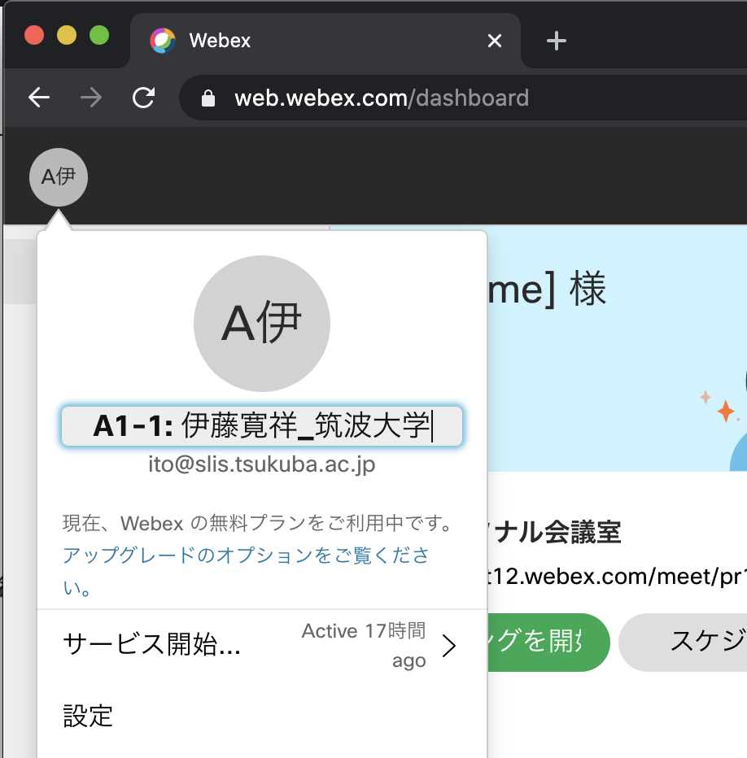

DEIM 2022はオンライン開催になりましたので、ポスター発表もoViceを使用したオンライン形式になります。

## オンラインポスター発表の手順
1. 自身の割り当てられたポスター発表のセッションの開始時刻10分前までに，ブラウザで[DEIM2022プログラム](https://cms.dbsj.org/deim2022/program/)を開き，oViceへ入ってください．
    * oViceを初めて使う際に名前の入力を求められます．**「A21-1:氏名_所属」「A21-1:氏名_研究室名」** のように，発表番号を名前に付けて，ほかの参加者に分かるようにご登録ください．
    * 一旦決定した名前を変更するには，Webex会議から退出している状態で表示名を変更する必要があります．
    	* 名前を変更するには，Webex のホームページにアクセス，ログインし，左上のアイコンをクリックすると編集できるようになります．
    * セッション開始前に一度画面共有の練習を行っておいてください．
    * 予定されたWebex会議室へアクセスできない場合はポータルトップの案内をご確認ください．トラブルが起きてWebex会議室が立ち上がらなかった場合など，予備のWebex会議室へ移動になることがあります（アクセスURLが変更になります）．その場合はポータルトップへ緊急アナウンスを出します．
    * （TODO）発表者の緊急連絡先は？
1. 自身のパソコン上で，PowerPoint等のプレゼンテーションアプリを用いて，自分のプレゼンテーション資料を立ち上げておいてください．
2. セッション開始**5分前** までに座長が入り、発表者が揃っているか確認します．もし表示名が上記の形式になっていない場合は，マイクをONにして座長に話しかけ，その旨をお伝えください．
3. 学生の発表者は学生プレゼンテーション賞の対象なので，座長から学生であるか確認があります．
4. 座長がセッションを開始しますので，自身の発表順をお待ちください．
    * 待機中はマイクはミュート、カメラもOFFでお願いします（雑音防止と通信帯域節約のため）．
    * セッションの進行は座長に一任されていますので，座長の指示がありましたら従ってください．
    	* 他の発表者に通信トラブルが発生した場合など，座長の判断で発表順が入れ替わることがあります．ご承知おきください．
6. 発表の順番になったら，Webex Meetingから，以下の３操作によりプレゼンテーションを開始してください．
    1. マイクのミュートを解除
    2.  インカメラをON
    3.  「コンテンツの共有」ボタンから，プレゼンテーション資料，あるいは画面全体を選択
    	* もし，プレゼンに動画が含まれている場合は，コンテンツの共有のオプション「モーションおよびビデオで最適化」を選んだ方がよい（下記）
7. 研究発表を行ってください．
    * **発表時間：15分**
    * 運営がベルで時間経過をお知らせします： 1鈴：12分，2鈴：15分
    * 発表全体を動画で行うことは，スポンサー企業の技術報告発表についてのみ認めます（ただし，生のプレゼンテーションの方が望ましいです）．
    * 発表者の都合が悪くなった場合は共著者の方が代理でご発表ください．
    * 疾病によって発表全体を事前録画した動画で行うことを希望する場合は，事前にプログラム委員長にご相談ください．なお，就職活動や個別の予定などの理由では，動画による発表は認めません（NO SHOWとして扱います）．
8. 発表が終了したら，座長のアナウンスに従い，画面上部のメニューからコンテンツの共有の停止，を選びプレゼンテーション資料の配信を停止する(スクリーンショット)．また、マイクをOFFにする．
9. 自身の発表が終わったらそのセッションに残ってください．セッションの最後にoVice上で纏めて質疑があります．
    * もしチャット欄にどなたかからの有益なコメントがあれば，ミーティングから退席する前にチャットを保存しておくと良いと思います（ファイル→保存→チャット）．
11. セッション内の発表全件が終わりますと，座長および運営からアナウンスがありますので，それに従ってoVice会場へ移り，そこで質疑応答を行ってください．
	1. チャット欄に流されたoViceのURLをクリックする．oViceがブラウザで開かれます．
	2. Webexの「退席」ボタンによりミーティングから退席します．
	3. 先ほど開いたブラウザ上のoViceへ移ります．
12. oVice上で質疑応答を開始してください．
    * oViceへ入りますと，そこには発表順ごとのブースになっており，各発表者はそこで待機します．オンラインポスター発表と同様の形式です．
    * 研究発表のスライドを画面共有し，質問に備えてください．
    * oViceに移ってすぐに質疑を開始してもらって構いません．聴衆に自由に話しかけて質問・コメントを受けてください．
    * 聴衆や座長・コメンテータとの質疑が一通り終わって時間が余りましたら，他の発表者と発表に関する研究議論を行っていただいて構いません．
    * **口頭発表とこの質疑が揃うことで「研究発表が行われた」として扱います．いずれかが欠けた場合はNO SHOWとして扱います．**
13. セッション終了時刻になりましたら，セッション終了のアナウンスが運営より流されます． 
    * oViceからの退場はブラウザのWindowやタブを閉じることで行えます．
    * oVice会場は休憩時間も使い続けられますので，発表者とのさらなる研究議論や，他の参加者との挨拶・雑談などにお使いください．
14. 各セッションの掲示板にて質問やコメントが投稿されることがあるので，できる限り対応をお願いします．

### 注意事項
- 発表者がプレゼン中（コンテンツを共有中）に，他の人がコンテンツを共有してしまうと，発表者の共有が停止されてしまうので，座長に指名されてからコンテンツの共有を開始してください．
- 外部にへの公開の予定はありませんが，発表の様子は録画されますので予めご了承ください．
- 各種アナウンスは原則ポータル上で行われますので，適宜ご確認ください．

（名前の変更の例 / Example of Changing Screen Name）

（プレゼンテーション開始の例 / Example of Starting Presentation）

（プレゼンテーション終了の例 / Example of Ending Presentation）

（モーションおよびビデオで最適化 / Optimization for Motion and Video）
（プレゼンテーションに動画がある場合）

