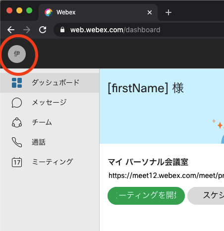
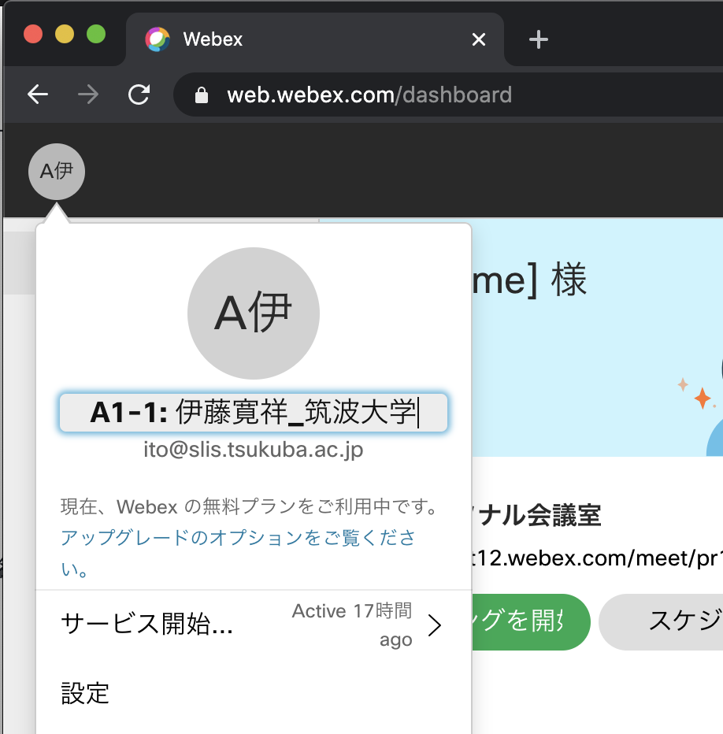
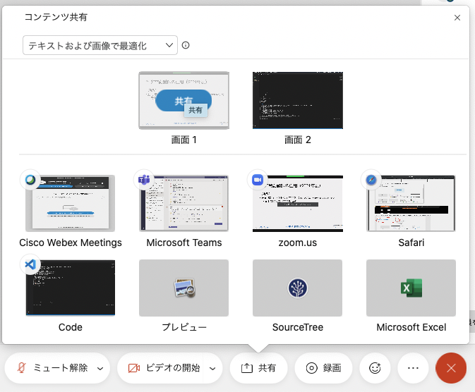
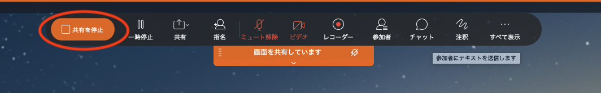
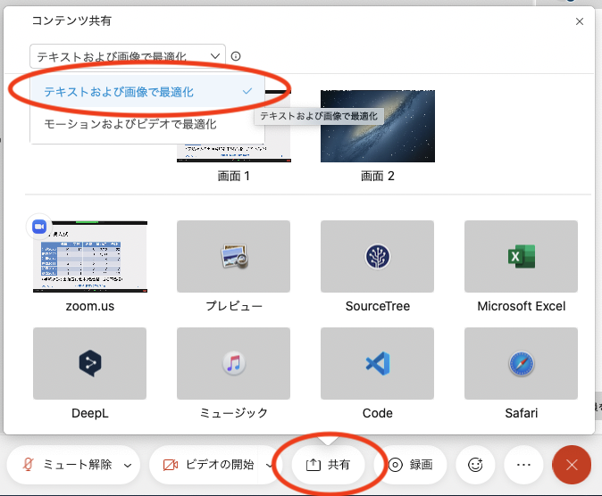

# DEIM 口頭発表者向けマニュアル（日本語）

[<<Home](README.md)

## 【重要！】DEIM 2022での新しい口頭発表形式について
* DEIM 2022ではWebexで研究発表をした際には質疑を行わず，1セッションの全ての発表が終わったら全員でoViceへ移動して，そこでまとめて質疑を行います．oVice内の質疑会場はオンラインポスター発表と同様の会場で，質疑の進行もポスター発表と同様です．
	* 各セッションの構成（125分 or 150分）
		* **前半：Webexで口頭発表**：1件15分の発表 × 4～6件（60～90分）
		* **後半：oVice上での質疑**：1セッション分まとめて残り時間一杯
	* 狙い
		1. 質疑への若手の参加機会の拡大：大勢が見ている中で顔も見えない状態での質疑は，若い人には「場違いでは無いか」と感じられて難しいという声がありました．また，質疑の時間が短いので，座長から1件とコメンテータから1件の質問が出ると質疑の時間が終わってしまうということがありました．
		2. コミュニティ内での会話機会創出：過去2年のDEIMのオンライン開催では，会議が終わるとWebexから退出するので，研究者間のコミュニケーション機会が非常に少なかったという声がありました．質疑によってoViceへ移動する人の流れを作ることで，そこが会話の場として使われることを狙っています．
	* 発表者の皆様へのお願い
		* 発表終了後は座長と運営のアナウンスに従ってoVice会場へ移り，継続して質疑応答を行ってください．
		* 聴衆や座長・コメンテータとの質疑が一通り終わって時間が余りましたら，他の発表者と発表に関する研究議論を行っていただいて構いません．
		* セッション終了後などもoVice会場は使えますので，お知合いの研究者や新しい研究者の方々とコミュニケーションをお楽しみいただければと思います．

## 口頭発表の手順
1. 各セッションのWebex会議室は遅くとも**開始時刻の10分前までには準備されます** ．
2. セッション開始10分前までに，ブラウザで[DEIM2022プログラム](https://cms.dbsj.org/deim2022/program/)を開き，「発表会場」というボタンを押し，[Webex Meeting](https://mediafiles.webex.com/ja/downloads.html)のセッションの会議室に入ってください．
    * Webexを初めて使う際に名前の入力を求められます．**「A21-1:氏名_所属」「A21-1:氏名_研究室名」** のように，口頭発表番号を名前に付けて，ほかの参加者に分かるようにご登録ください．
    * **大学教員の方は氏名の前に★印をつけてください．**（例）「A21-1：★横山昌平_東京都立大学」
    * 一旦決定した名前を変更するには，Webex会議から退出している状態で表示名を変更する必要があります．
    	* 名前を変更するには，Webex のホームページにアクセス，ログインし，左上のアイコンをクリックすると編集できるようになります．
    * セッション開始前に一度画面共有の練習を行っておいてください．口頭発表練習用のWebex会議セッションは、2月24日、25日の9:00am～5:00pmに利用可能です。[DEIM 2022プログラム](https://cms.dbsj.org/deim2022/program/)を開くと、先頭に「口頭発表練習」セッション（X1, Y1, X2, Y2）がありますので、「会場」ボタンから入って練習してください。
    * 予定されたWebex会議室へアクセスできない場合はポータルトップの案内をご確認ください．トラブルが起きてWebex会議室が立ち上がらなかった場合など，予備のWebex会議室へ移動になることがあります（アクセスURLが変更になります）．その場合はポータルトップへ緊急アナウンスを出します．
    * **当日に何らかの理由で発表が困難な状況に陥っているなど，緊急で連絡が必要な場合は deim2022-inquiry@googlegroups.com にメールしてください．**
    * Webexにアクセスできていてセッション直前でしたら，座長や学生アルバイトに口頭でお伝えください．
1. 自身のパソコン上で，PowerPoint等のプレゼンテーションアプリを用いて，自分のプレゼンテーション資料を立ち上げておいてください．
2. セッション開始**5分前** までに座長が入り、発表者が揃っているか確認します．もし表示名が上記の形式になっていない場合は，マイクをONにして座長に話しかけ，その旨をお伝えください．
3. 学生の発表者は学生プレゼンテーション賞の対象なので，座長から学生であるか確認があります．
4. 座長がセッションを開始しますので，自身の発表順をお待ちください．
    * 待機中はマイクはミュート、カメラもOFFでお願いします（雑音防止と通信帯域節約のため）．
    * セッションの進行は座長に一任されていますので，座長の指示がありましたら従ってください．
    	* 他の発表者に通信トラブルが発生した場合など，座長の判断で発表順が入れ替わることがあります．ご承知おきください．
6. 発表の順番になったら，Webex Meetingから，以下の３操作によりプレゼンテーションを開始してください．
    1. マイクのミュートを解除
    2.  あるならばカメラをON
    3.  「コンテンツの共有」ボタンから，プレゼンテーション資料，あるいは画面全体を選択
    	* もし，プレゼンに動画が含まれている場合は，コンテンツの共有のオプション「モーションおよびビデオで最適化」を選んだ方がよい（下記）
7. 研究発表を行ってください．
    * **発表時間：15分**
    * 運営がベルで時間経過をお知らせします： 1鈴：12分，2鈴：15分
    * 発表者の都合が悪くなった場合は共著者の方が代理でご発表することも可能です．
    * セッション時間内で発表が行われなかった場合は「NO SHOW」として扱われ，最終予稿集に不掲載となります．ご注意ください．
8. 発表が終了したら，座長のアナウンスに従い，画面上部のメニューからコンテンツの共有の停止，を選びプレゼンテーション資料の配信を停止する(スクリーンショット)．また、マイクをOFFにする．
9. 自身の発表が終わったらそのセッションに残ってください．セッションの最後にoVice上で纏めて質疑があります．
    * もしチャット欄にどなたかからの有益なコメントがあれば，ミーティングから退席する前にチャットを保存しておくと良いと思います（ファイル→保存→チャット）．
11. セッション内の発表全件が終わりますと，座長および運営からアナウンスがありますので，それに従ってoVice会場へ移ってください．
    * チャット欄に流されたoViceのURLをクリックしてください．oViceがブラウザで開かれます．**ブラウザは必ずChromeを使用してください．**
    * oViceでの質疑会場には，ブラウザで[DEIM2022プログラム](https://cms.dbsj.org/deim2022/program/)を開き，そこの「質疑会場」ボタンからも入ることが出来ます．
    * oViceを初めて使う際に名前の入力を求められます．こちらも **「A21-1:氏名_所属」「A21-1:氏名_研究室名」という形式** でご登録ください．
    	* **大学教員の方は氏名の前に★印をつけてください．**（例）「A21-1：★横山昌平_東京都立大学」
    	* 一旦設定した名前を変更するには、画面上の自分のアイコンをクリックすれば設定画面が表示されます．
    	* 口頭発表とインタラクティブ発表を両方おこなう方は，インタラクティブ発表のときは「day2-p11:氏名_所属」「day2-p11:氏名_研究室名」という形式に名前を変更願います．
    * oViceでDEIMの各フロアに入る際に，デバイスの使用許可（マイクとカメラ）と通知の許可が求められます．許可を与えてください．
    * セッション開始前に一度oViceの操作の練習を行っておいてください．質疑用のoVice会場は，2月24日18:00時点で準備が完了して本番同様の状態になっています．
        * [DEIM 2022プログラム](https://cms.dbsj.org/deim2022/program/)から，各口頭発表セッションの「質疑会場」ボタンから入ることができます．ご自由に練習ください．
12. Webexの「退席」ボタンによりミーティングから退席して，先ほど開いたブラウザ上のoViceへ移ります．
13. oVice上で質疑応答ブースに移動します．
    * oViceへ入りますと，そこには発表順ごとのブースが用意されています．各発表者はそこで待機します．オンラインポスター発表と同様の形式です．
    	* （例）J会場の1番目の発表者は「J1」，3番目の発表者は「J3」に入って待機します．
14. ブースの四角い「oVice会議室」の内側をクリックし，ブースに入ります．
    * 「oVice会議室」では、内部の声が外部に漏れません。逆も漏れないので，混線の心配がありません．また画面共有が会議室内でだけ共有されます．
      * マイクやカメラは常時ONでも構いません．また，画面共有を開始しておいても大丈夫です．
    * **oVice会議室から出るのには，画面下部の以下のボタンを押してください．**
	
15. 質問者が来て質問・コメントされたら，それに応じて質疑を行ってください．
    1. マイクのミュートを解除
    2. あるならばカメラをON
    4. 発表資料を画面共有する．「コンテンツの共有」ボタンから，プレゼンテーション資料を選択
    * oViceに移ってすぐに質疑を開始してもらって構いません．聴衆に自由に話しかけて質問・コメントを受けてください．
    * 聴衆や座長・コメンテータとの質疑が一通り終わって時間が余りましたら，他の発表者と発表に関する研究議論を行っていただいて構いません．
16. セッション終了時刻になりましたら，セッション終了のアナウンスが運営より流されます． 
    * oViceからの退場はブラウザのWindowやタブを閉じることで行えます．
    * oVice会場は休憩時間も使い続けられますので，発表者とのさらなる研究議論や，他の参加者との挨拶・雑談などにお使いください．
17. 各セッションの掲示板にて質問やコメントが投稿されることがあるので，できる限り対応をお願いします．

### 注意事項
- 発表者がプレゼン中（コンテンツを共有中）に，他の人がコンテンツを共有してしまうと，発表者の共有が停止されてしまうので，座長に指名されてからコンテンツの共有を開始してください．
- **NO SHOWの取り扱いについて**
	- **DEIM 2022においては、「Webexにおいてプレゼンをした ＋ oViceで質疑をした」の2点が揃うことで「発表をした」と見做します．**
	- 共著者による発表も可能です．
	- **NO SHOWの場合は，プログラムから削除され，最終予稿集に不掲載となります．** ご注意ください．
- ~~外部にへの公開の予定はありませんが，発表の様子は録画されますので予めご了承ください．~~ DEIM運営によって発表が録画されることはありません（DEIM 2022から変更になりました）．
- 各種アナウンスは原則ポータル上で行われますので，適宜ご確認ください．
- **ハラスメント行為を受けた場合の対応について**：oViceのブース内などでハラスメント行為を受けた場合は以下のように対応してください．
	1.「これはハラスメント行為です、プログラム委員長へ通報します」と宣言する
	2. oViceを閉じるなどして**全力で逃げる**
	3. deim2022-inquiry@googlegroups.com へメールで報告する
	4. 発表や質疑を途中で中断したとしてもNO SHOWとは扱われません．避難の方が大切です．

## Tips
（名前の変更の例 / Example of Changing Screen Name）

（プレゼンテーション開始の例 / Example of Starting Presentation）

（プレゼンテーション終了の例 / Example of Ending Presentation）

（モーションおよびビデオで最適化 / Optimization for Motion and Video）
（プレゼンテーションに動画がある場合）

