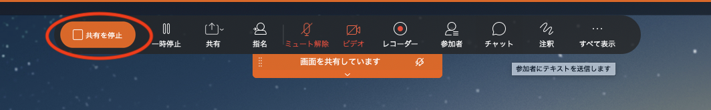

# How to have an Oral Presentation at DEIM forum

[<<Home](README.md)

## 【IMPORTANT】Regarding the new oral presentation style in DEIM 2022
* In DEIM 2022, we don't have Q & A time after each presentation in Cisco Webex. Instead, however, after all presentations in a session done there, all presenters and attendees move to oVice and together have Q & A time there. The Q & A venue in oVice and its processes are the same as those of the online poster presentation.
* The structure of each session (125 minutes or 150 minutes)
	* **1st half: oral presentations in Webex**：15 minutes for each presentation * 4 - 6 presentations (totally 60 - 90 minutes)
	* **2nd half：Q & A in oVice**: The remaining time of the session

## Procedures of an oral presentation
1. **By 10 minutes before the starting time**, the meeting room for each session becomes ready to enter.
2. Access to [DEIM 2022 program](https://cms.dbsj.org/deim2022/program/) until 10 minutes before the starting time, click "発表会場" button  to enter the [Webex](https://mediafiles.webex.com/ja/downloads.html) meeting room for your presentation.
    * When you firstly use Webex, the input of your name is required. Input your name as **"A21-1:name_affiliation"** to show that you are a presenter.
    * To change the name after once inputted it, you need to sign-out from Webex.
    * o	It’s a good idea to have a practice before the real presentation.
    	* The Webex meeting rooms for practice are available during 9:00am - 5:00pm on Feb. 24th and 25th. You can find "口頭発表練習" sessions (X1, Y1, X2, Y2) on [DEIM 2022 program](https://cms.dbsj.org/deim2022/program/). Click the "会場" button to enter.
    * When we have some technical issues of the Webex meeting room, we show an emergency announcement at the top of [DEIM portal](https://cms.dbsj.org/deim2022/program/). There is a chance that we use a backup meeting room when the original meeting room has a trouble. In that case, the URL of the meeting room can be changed.
    * **If you have any difficulty to have your presentation on the day (before entering the Webex meeting room), please email to "deim2022-inquiry@googlegroups.com"．**
3. Wait with your presentation material (e.g., PPT slides) opened.
4. **By 5 minutes before the starting time**, the session chair of the session enters into the meeting room, and check whether all the presenters are there or not.
5. The chair starts the session on the staring time.
    * During waiting, please turn off your microphone and video.
6. When your turn comes, you start your presentation by following the three steps below.
     1. Unmute the microphone
     2. Turn on the video
     3. Using the "Share Content" button, share your entire screen or the window of your presentation material.
7. You make your presentation
    * **Time for each presentation: 15 minutes**
    * Bells inform you the progress of your time: one bell: 12 minutes, two bells: 15 minutes
    * It's allowed that one of co-authors has the presentation instead of the first author. 
    * If a presentation is not shown in the allocated session, the paper is treated as "NO SHOW" and will not be included in the proceedings of the DEIM forum.
8. When you finish your presentation, following the chair's suggestions,
    1. Stop sharing your screen from the menu at the top of the screen, and
    2. Mute your microphone.
10. You need to stay in the session after your presentation finished, since you have a Q & A time in oVice after all presentations finished.
11. When all presentations finish, follow the guides from the session chair and organizers to move to oVice Q & A space.
    * The URL of the oVice space will be provided in the chat space of the Webex meeting. Click it.
    * **Make sure to use "Google Chrome browser" for accessing oVice.**
    * You also can access to the Q & A space at oVice by opening [DEIM2022 program](https://cms.dbsj.org/deim2022/program/) and clicking the "質疑会場" button of your session.
    * When you first access to the oVice space, inputting your name is requested. Input your name as like **"A21-1:name_affiliation"**.
    	* To change your name after once inputted, click your icon on the oVice screen to open the window of settings.
    * When entering each floor of oVice DEIM venue, oVice requires the allowance to use microphone and camera. Click "allow".
    * o	It’s a good idea to have a practice how to use the oVice venue before the real session. The oVice venue is ready by the morning of each session day.
        * Further, the oVice venue for practice is available during 9:00am - 5:00pm on Feb. 24th and 25th. You can find "インタラクティブ練習" sessions (Z1 and Z2) on [DEIM 2022 program](https://cms.dbsj.org/deim2022/program/). Click the "会場" button to enter.
12. Now, you can quit from Webex meeting, and switch to oVice for Q & A.
13. In the oVice venue, move to the Q & A booth allocated for your presentation.
    * After entering oVice, you can find cubicles with the numbering corresponding to your presentation number. Each presenter uses one cubicle (similar to a poster booth).
    	* e.g., The first presenter of J room use "J1" booth and the third presenter uses "J3".
14. Click the inside of the cubicle to enter into the "oVice meeting room".
    * The functionality of "meeting room" in oVice isolates the inside of the room from the outside. Your conversation doesn't go out, and outside conversation doesn't come in.
    * Further, a shared screen is effective to the people inside the meeting room.
    * **To exit from the oVice meeting room, click the following exit button at the bottom of the oVice screen.**
	
15. When an audience comes in, enjoy discussion about your great presentation.
    1. Unmute the microphone.
    2. Turn on camera
    4. Share your presentation material.
    * Soon after entering the oVice venue, you can start the Q and A.
    * After answering all questions from the session chairs, the commentator, and audiences, if you still have the remaining time, you can enjoy discussion with other presenters.
16. At the time of ending the session, an organizer announces the end of the session. 
    * You can exit from the oVice venue by closing the browser tab or window.
    * The oVice venue is available through the DEIM forum period, enjoy discussion or chatting with other audiences.
17. After presentation, you may receive questions about your study on the bulletin board for each session. Try to reply them.

### Important notice
- If a new screen sharing starts during another screen sharing is in progress in a Webex meeting, the precedent sharing screen is unexpectedly ended. Thus, each presenter needs to start her/his sharing screen after the guide from the session chair.
- **Regarding how DEIM treats "NO SHOW"**
	- **In DEIM 2022, a presentation is recognized as completed when one of its authors BOTH "makes a presentation in the Webex session" AND "attends Q and A in the oVice venue." Otherwise, it's treated as "NO SHOW."**
	- **The paper of "NO SHOW" will be removed from the program and not be included in the proceedings of the DEIM forum.**
- DEIM organizers don't record the presentations. **Recording presentations are not allowed.**
- Important notices through the DEIM forum period will be shown at the top of [DEIM portal](https://cms.dbsj.org/deim2022/program/).

## Tips
### Example of changing the display name in Webex
- Note, you need to exit from a Webex meeting to change the display name. So far we know, there is no menu to change the display name inside of a meeting.

### How to start sharing screen in a Webex meeting

### How to stop sharing screen

### How to optimize for "motion and video" when you share a screen or a window in Webex.
- This configuration is recommended if you have a video in your presentation.

