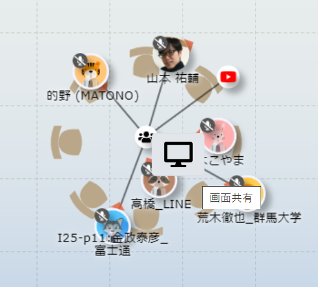
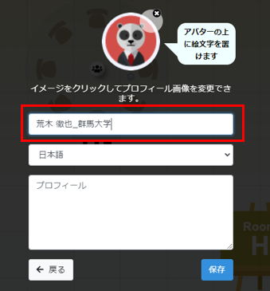
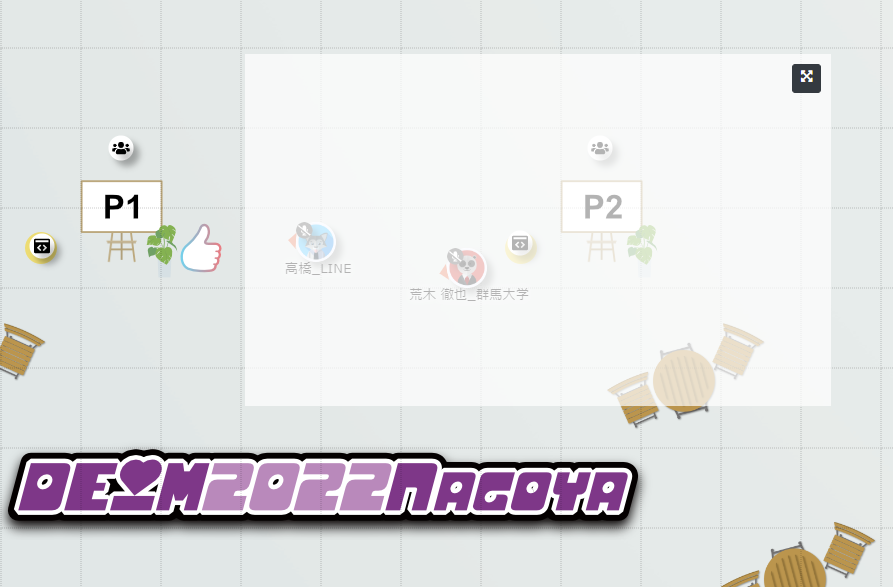

# DEIM oViceマニュアル（日本語）
### ブラウザはChromeでアクセスしてください
1. oViceへの入室  
  スペース内での名前を入力し，同意をチェックを入れて次へをクリックしてください．次にスピーカー・マイク・カメラの設定を求めれられるので適宜設定してください．また，入室時・フロア移動時にブラウザからマイクを使用するとカメラを使用するの許可を求められるので，許可して入室してください．  
    * 名前は発表者は「A21-1:氏名_所属」「A21-1:氏名_研究室名」のように，発表番号を名前に付けて，ほかの参加者に分かるようにご登録ください．参加者は「氏名_所属」という形式でご登録ください．一旦決定した名前は入室後に自分のアイコンをクリックすることでいつでも変更することができます．

2. oVice内での移動  
  自分のアイコンをドラッグするまたは行きたいところをダブルクリックすることで移動することできます．アイコンをドラッグ時に見える黒い円内が聞こえる範囲です．聴きたい発表者・企業ブース・会話したい人が黒い円内に入るように移動してください．会話したい相手が黒い円内に入ったら，カメラ・マイクを適宜オンにして会話等を始めてください(入室時はカメラ・マイクともにオフになっています)．  
    * ディスプレイのサイズによってはoViceの部屋が表示しきれない場合があります．ブラウザの横スクロール・縦スクロールで目的の場所までスクロールして移動してください．
   
   
   
    * 画面左の１から６の数字をクリックすることでフロアを移動することができます．  
    1F ホール  
    2F インタラクティブ１  
    3F インタラクティブ２  
    4F 口頭-ABCD  
    5F 口頭-EFG  
    6F 口頭-HJK  
   
   
 
 
3. ミーティングオブジェクトの使い方  
   口頭発表の質疑応答・インタラクティブ発表では発表ごとに１つミーティングオブジェクトが設置されています．ミーティングオブジェクトに接続することで，接続者全員と会話や画面共有をすることができます．  
   * 接続方法：ミーティングオブジェクトをダブルクリックする．接続に成功するとアイコンとミーティングオブジェクトの間に線が引かれます．（ある程度ミーティングオブジェクトに近くないと接続することができません）  
   * 切断方法：ミーティングオブジェクトから一定距離離れると自動的に切断されます．
   
   
   
   * 画面共有:ミーティングオブジェクトを右クリックすると画面共有のアイコンが出てくるので，それをクリックしてください．
   
   

4. oVice内での操作  
　　* 名前の変更：自分のアイコンをクリックすることで変更することができます．  
   
    

　　* フレームの移動：ポスターなどのフレームがアイコンの上に覆いかぶさって，移動ができなくなることがあります．その際はフレームをドラッグしてフレームを移動させてください．  
   
    
    

### 以下のoVice公式ガイド等もご参考にしてください

[oVice使い方ガイド](https://www.youtube.com/watch?v=C8r02gYDA50&t=3s)

[oViceデモ](https://tour.ovice.in/)

[oViceヘルプセンター](https://ja.ovice.wiki/)
