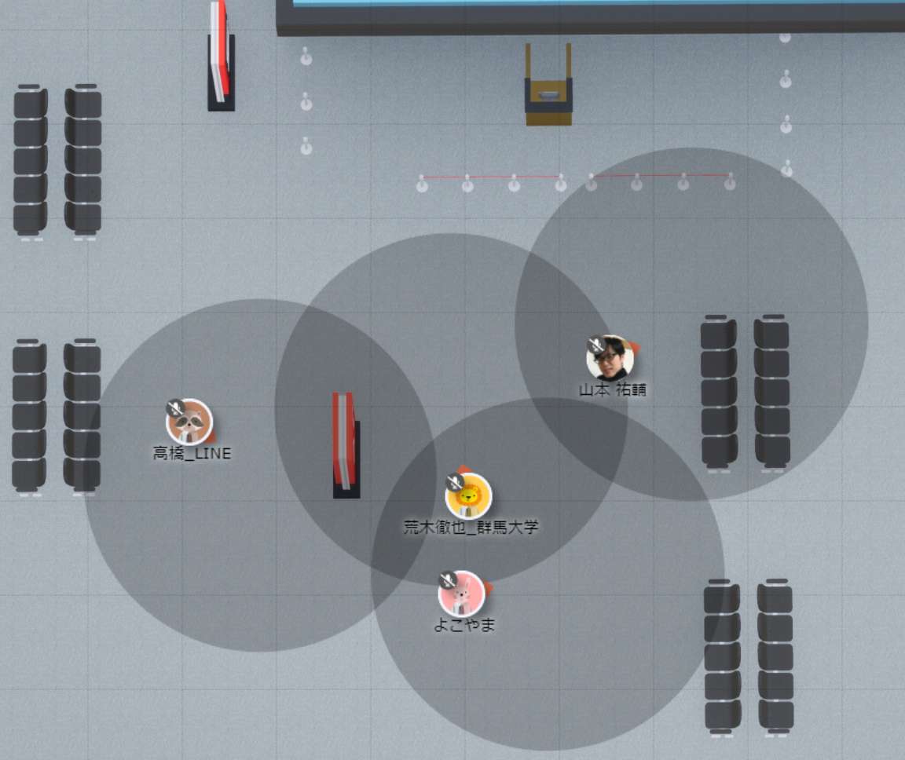

# DEIM oViceマニュアル（日本語）

1. oViceへの入室 
   スペース内での名前を入力して同意をチェックを入れて次へをクリックしてください．次にスピーカー・マイク・カメラの設定を求めれられるので適宜設定し入室してください． 
     * 名前は発表者は「A21-1:氏名_所属」「A21-1:氏名_研究室名」のように，発表番号を名前に付けて，ほかの参加者に分かるようにご登録ください．参加者は「氏名_所属」という形式でご登録ください．一旦決定した名前は自分のアイコンをクリックすることでいつでも変更することができます．
2. oVice内での移動 
   自分のアイコンをドラッグすることで移動することできます．ドラッグ時に見える黒い円内が聞こえる範囲です．聴きたい発表者・企業ブース・会話したい人が黒い円内に入るように移動してください．
   * ディスプレイのサイズによってはoViceの部屋が表示しきれない場合があります．ブラウズの横スクロール・縦スクロールで目的の場所までスクロールして移動してください．
   
   

3. oVice内で操作 
   * 画面共有:Webexと同様に画面の共有することができます．画面が共有される範囲は会話できる範囲と同じく自分の近くにいる人のみに共有されます．発表者は適宜資料を画面共有して，活発に議論を行ってください．
   
   

   * メガホン:部屋全体に向けて話すことができます．座長や実行委員が部屋全員に連絡する際に使います．発表者・参加者は緊急時以外は使わないでください．
   
   

### 以下のoVice公式ガイドも参考にしてください

[oVice 使い方ガイド](https://www.youtube.com/watch?v=C8r02gYDA50&t=3s)
(初めての方向け)

[oViceデモ](https://tour.ovice.in/)
(oViceスタッフに質問できます(平日9:00-17:30)) 

[oViceヘルプセンター](https://ja.ovice.wiki/)
