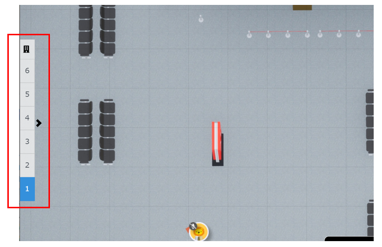
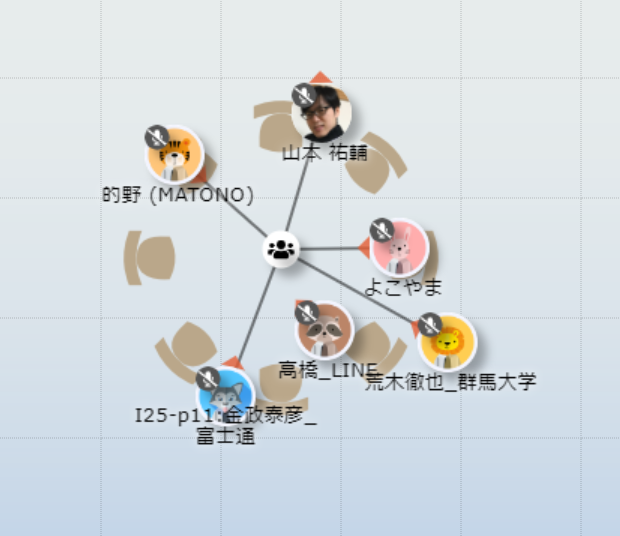

# DEIM oViceマニュアル（日本語）
### ブラウザはChromeでアクセスしてください
1. oViceへの入室  
  スペース内での名前を入力し，同意をチェックを入れて次へをクリックしてください．次にスピーカー・マイク・カメラの設定を求めれられるので適宜設定してください．また，入室時・フロア移動時にブラウザからマイクを使用するとカメラを使用するの許可を求められるので，許可して入室してください．  
    * 名前は発表者は「A21-1:氏名_所属」「A21-1:氏名_研究室名」のように，発表番号を名前に付けて，ほかの参加者に分かるようにご登録ください．参加者は「氏名_所属」という形式でご登録ください．一旦決定した名前は入室後に自分のアイコンをクリックすることでいつでも変更することができます．
2. oVice内での移動  
  自分のアイコンをドラッグするまたは行きたいところをダブルクリックすることで移動することできます．アイコンをドラッグ時に見える黒い円内が聞こえる範囲です．聴きたい発表者・企業ブース・会話したい人が黒い円内に入るように移動してください．会話したい相手が黒い円内に入ったら，カメラ・マイクを適宜オンにして会話等を始めてください(入室時はカメラ・マイクともにオフになっています)．  
    * ディスプレイのサイズによってはoViceの部屋が表示しきれない場合があります．ブラウザの横スクロール・縦スクロールで目的の場所までスクロールして移動してください．
   
   
   
   
 
 
3. ミーティングオブジェクトの使い方  
   ミーティングオブジェクトに接続することで，接続者全員と会話や画面共有することができる．  
   接続方法  
   遮断方法  
   
   

4. oVice内で操作  
   * 画面共有:Webexと同様に画面の共有することができます．画面が共有される範囲は会話できる範囲と同じく自分の近くにいる人のみに共有されます．発表者は適宜資料を画面共有して，活発に議論を行ってください．
   
   

   * メガホン:部屋全体に向けて話すことができます．座長や実行委員が部屋全員に連絡する際に使います．一般の発表者・参加者は緊急時以外は使わないでください．
   
   

### 以下のoVice公式ガイド等もご参考にしてください

[oVice使い方ガイド](https://www.youtube.com/watch?v=C8r02gYDA50&t=3s)

[oViceデモ](https://tour.ovice.in/)

[oViceヘルプセンター](https://ja.ovice.wiki/)
