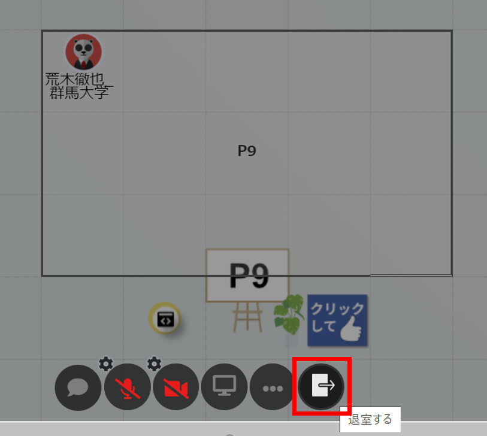
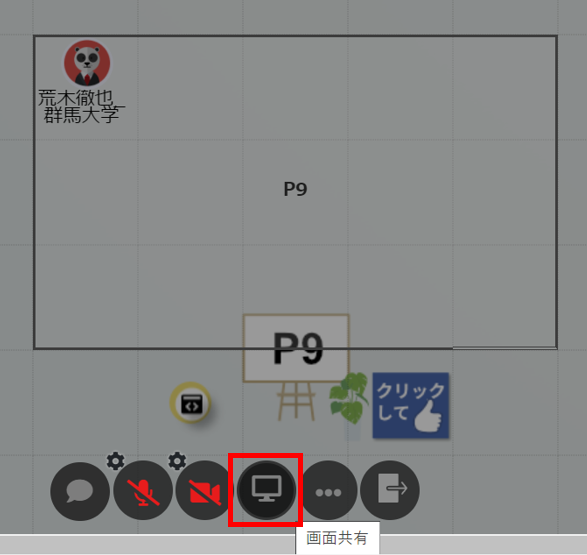
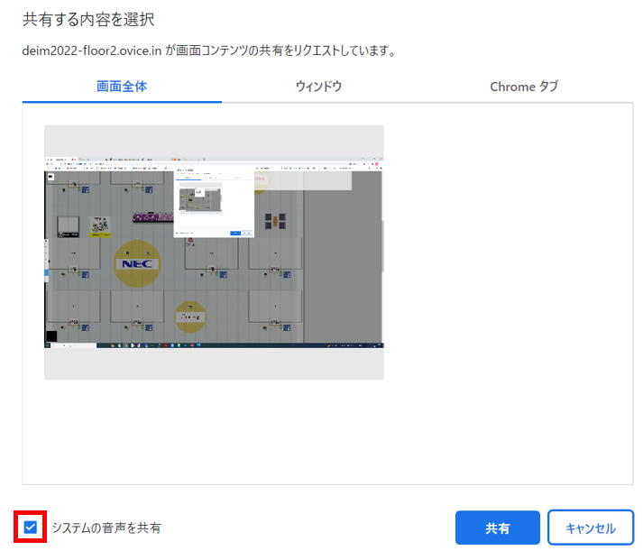

# DEIM oViceマニュアル（日本語）
### ブラウザはChromeでアクセスしてください
1. oViceへの入室  
  スペース内での名前を入力し，同意をチェックを入れて次へをクリックしてください．次にスピーカー・マイク・カメラの設定を求めれられるので適宜設定してください．また，入室時・フロア移動時にブラウザからマイクを使用するとカメラを使用するの許可を求められるので，許可して入室してください．  
    * 名前は発表者は「A21-1:氏名_所属」「A21-1:氏名_研究室名」のように，発表番号を名前に付けて，ほかの参加者に分かるようにご登録ください．座長は「A13座長：氏名_所属」，コメンテーターは「F31コメ：氏名_所属」のように，参加者は「氏名_所属」という形式でご登録ください．一旦決定した名前は入室後に自分のアイコンをクリックすることでいつでも変更することができます．
    * 大学教員の方は氏名の前に★印をつけてください．（例）「A21-1：★横山昌平_東京都立大学」

2. oVice内での移動  
  「自分のアイコンをドラッグする」または「行きたいところをダブルクリックする」ことで移動することできます．アイコンをドラッグ時に見える黒い円内が聞こえる範囲です．聴きたい発表者・企業ブース・会話したい人が黒い円内に入るように移動してください．会話したい相手が黒い円内に入ったら，カメラ・マイクを適宜オンにして会話等を始めてください(入室時はカメラ・マイクともにオフになっています)．  
    * ディスプレイのサイズによってはoViceの部屋が表示しきれない場合があります．ブラウザの横スクロール・縦スクロールで目的の場所までスクロールして移動してください．
   
   
   
    * 画面左の１から６の数字をクリックすることでフロアを移動することができます．  
    1F 談話広場  
    2F インタラクティブ１  
    3F インタラクティブ２  
    4F 口頭-ABCD  
    5F 口頭-EFG  
    6F 口頭-HJK  
   
   
 
 
3. 会議室の使い方  
   口頭発表の質疑応答・インタラクティブ発表では発表ごとに会議室が設置されています．会議室に入室することで，外部から邪魔をされずに会議室内全員と会話や画面共有をすることができます．  
   * 入室方法：会議室の四角の範囲内をクリックすることで入室することができます．
   * 退出方法：下側の右端のドアのボタンをクリックすると退出することができます．
   
   
   
   * 画面共有:下側の真ん中あたりにある画面のボタンをクリックすると画面共有をすることができます（動画などの音声も共有したいときは「システムの音声を共有する」にチェックを入れてください）．
   
   
   
   

4. oVice内での操作  
   * 名前の変更：自分のアイコンをクリックすることで変更することができます．  
   
   

   * フレームの移動：ポスターなどのフレームがアイコンの上に覆いかぶさって，移動ができなくなることがあります．その際はフレームをドラッグしてフレームを移動させてください． 
　  
   
   

    

### 以下のoVice公式ガイド等もご参考にしてください

[oVice使い方ガイド](https://www.youtube.com/watch?v=C8r02gYDA50&t=3s)

[oViceデモ](https://tour.ovice.in/)

[oViceヘルプセンター](https://ja.ovice.wiki/)

# DEIM Manual for oVice (English version)
1. Enter oVice  
  Enter your name in the space, check the box for consent, and click Next. Next, you will be asked to set the speaker, microphone, and camera settings. You will also be asked for permission to use the microphone and camera from your browser when you enter the room or move to the floor, so please enter the room with permission.  
    * If you are a presenter, please register your name as "A21-1:Firstname Familyname Univ. Name" or "A21-1:Firstname Familyname Lab. Name", and add your presentation number to your name so that other participants can recognize you. Participants are requested to register as "Firstname Familyname Affiliation Name". You can change your name at any time by clicking on your icon after entering the room.  
    
2. Moving in oVice  
  You can move by "dragging your icon" or "double-clicking where you want to go". The black circle you see when you drag the icon is the area where you can hear. Move so that the presenter, company booth, or person you want to talk to is within the black circle. Once the person you want to talk to is within the black circle, turn on the camera and microphone as appropriate and start a conversation (the camera and microphone are off when you enter the room).  
    * Depending on the size of your display, the oVice room may not be fully displayed. Please scroll to the desired location by scrolling horizontally or vertically in your browser.  
    * You can move around the floor by clicking on the numbers 1 to 6 on the left side of the screen.  
    1F Hall  
    2F Interactive 1  
    3F Interactive 2  
    4F Oral-ABCD  
    5F Oral-EFG  
    6F Oral-HJK  

3. Use the meeting room  
   A meeting room will be set up for each presentation in the oral question and answer session and interactive presentation. By entering the conference room, you can talk and share the screen with everyone in the conference room without being disturbed from outside.  
   * Enter the meeting room: You can enter the meeting room by clicking within the square of the meeting room.
   * Exit the meeting room: Click the door button on the right side of the bottom to leave the meeting room.
   * Screen sharing: Click on the screen button in the middle of the bottom side to share the screen (if you want to share audio such as video, check "Share system audio").

4. Ohter operations in oVice  
   * Rename: You can change the name by clicking on your icon.  
   * Move frame: Sometimes a frame such as a poster covers your icon and you can't move it. In this case, drag the frame to move it. 

### Please also refer to the following official oVice guides.

[oVice usage guide](https://www.youtube.com/watch?v=C8r02gYDA50&t=3s)

[oVice Demo](https://tour.ovice.in/)

[oVice Help Center](https://ja.ovice.wiki/)

